# 30DayMapChallenge

Day 1: Points
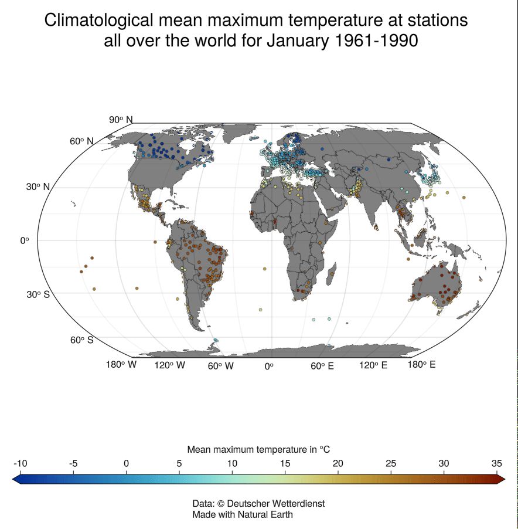

Day 2: Lines
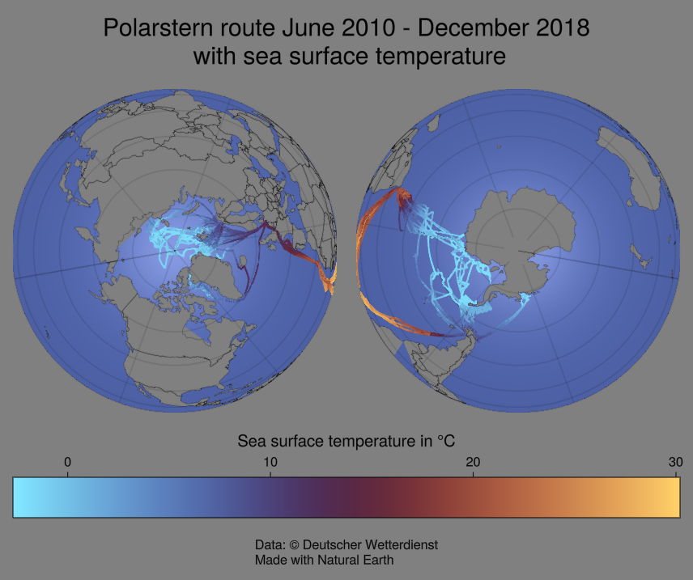

Day 3: Polygons
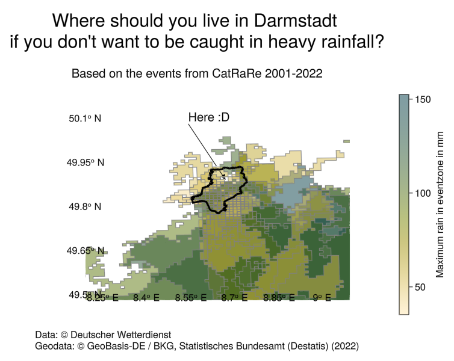

Day 4: A Bad Map
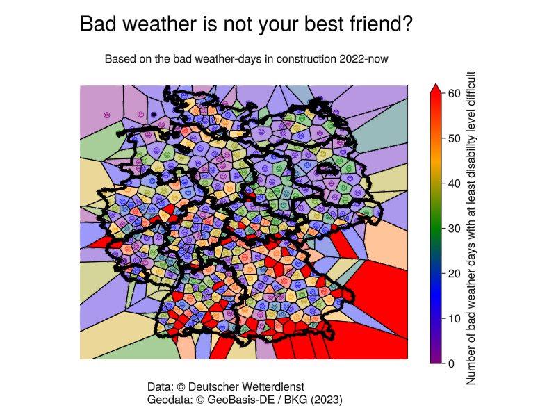

Day 5: Analog
Maybe later

Day 6: Asia
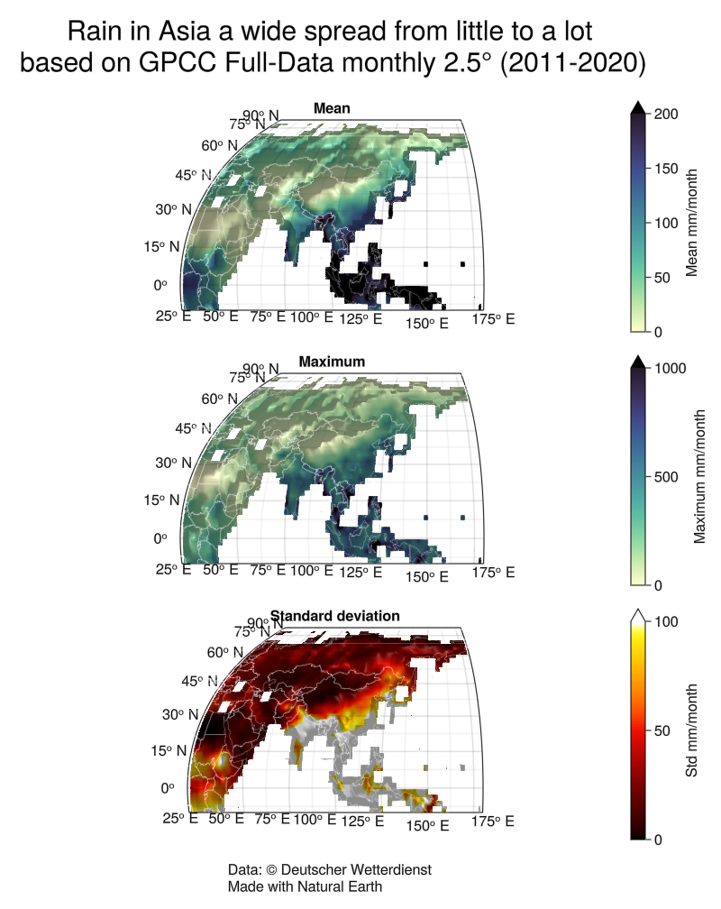
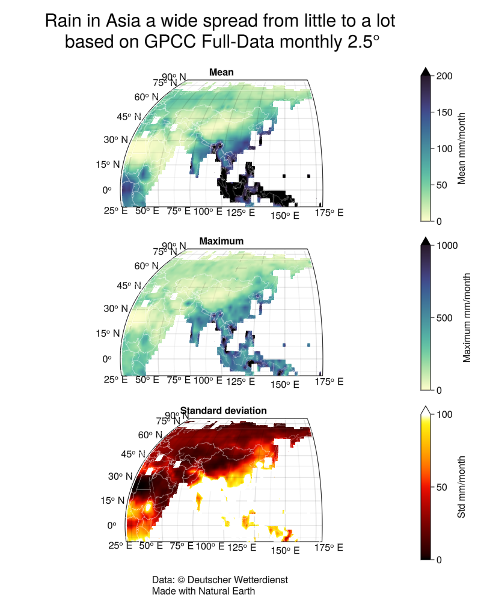

Day 8: Africa
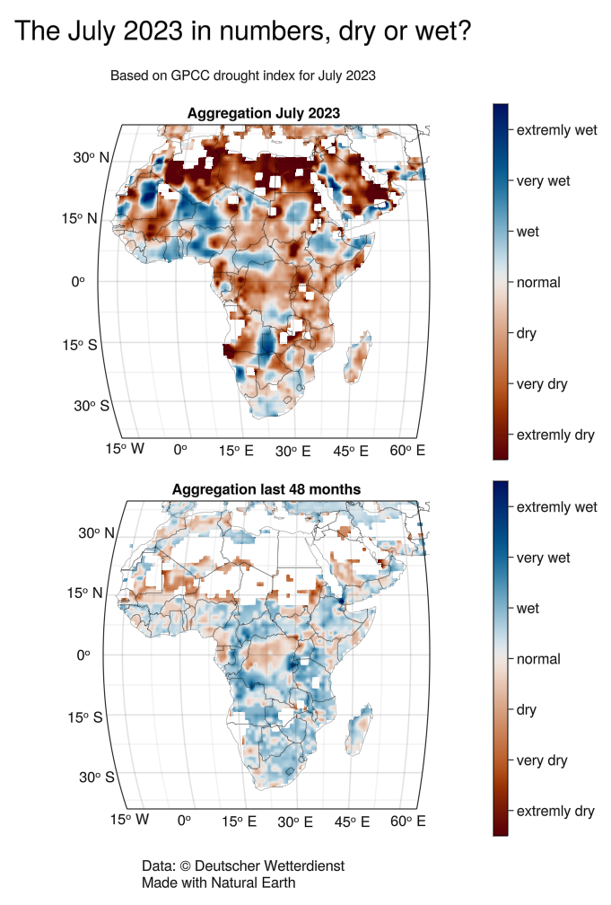

Day 9: Hexagons
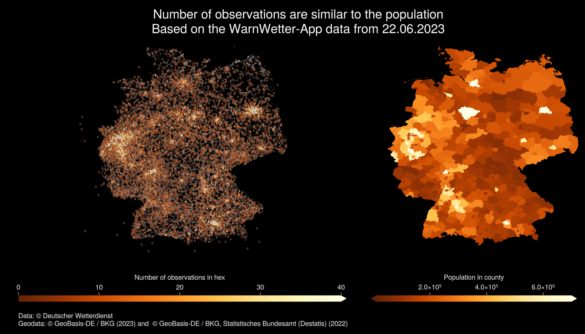

Day 13: Choropleth
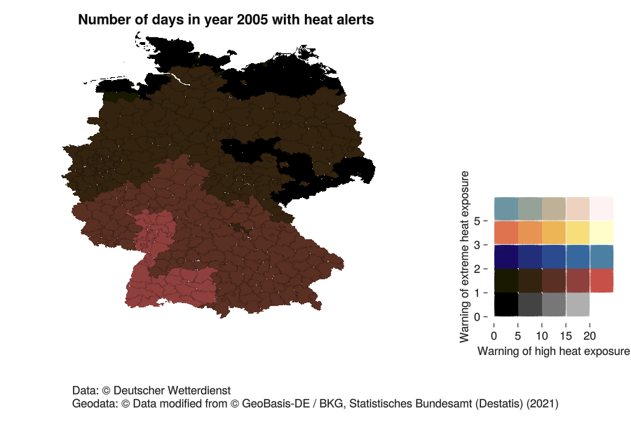

Day 14: Europe
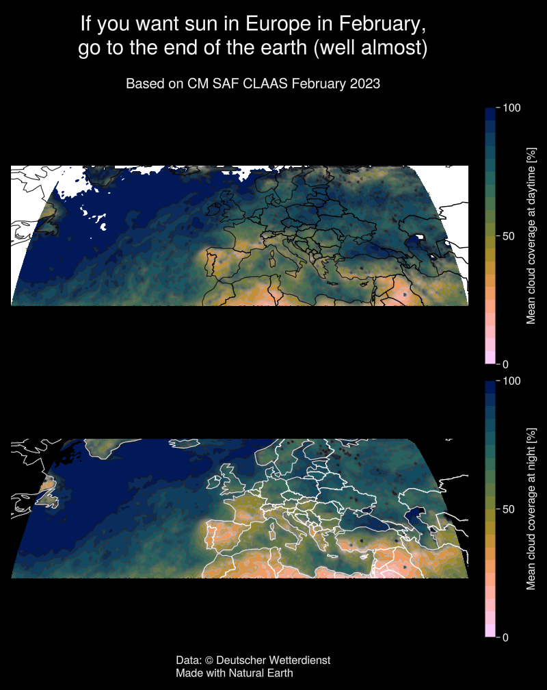

Day 15: Openstreetmap
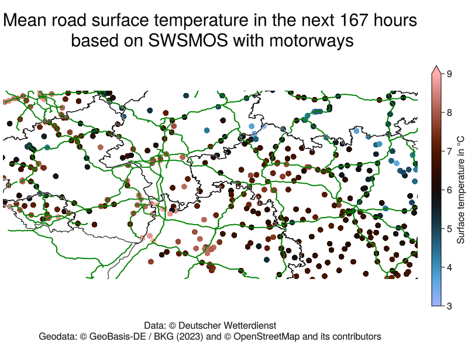

Day 17: Flow
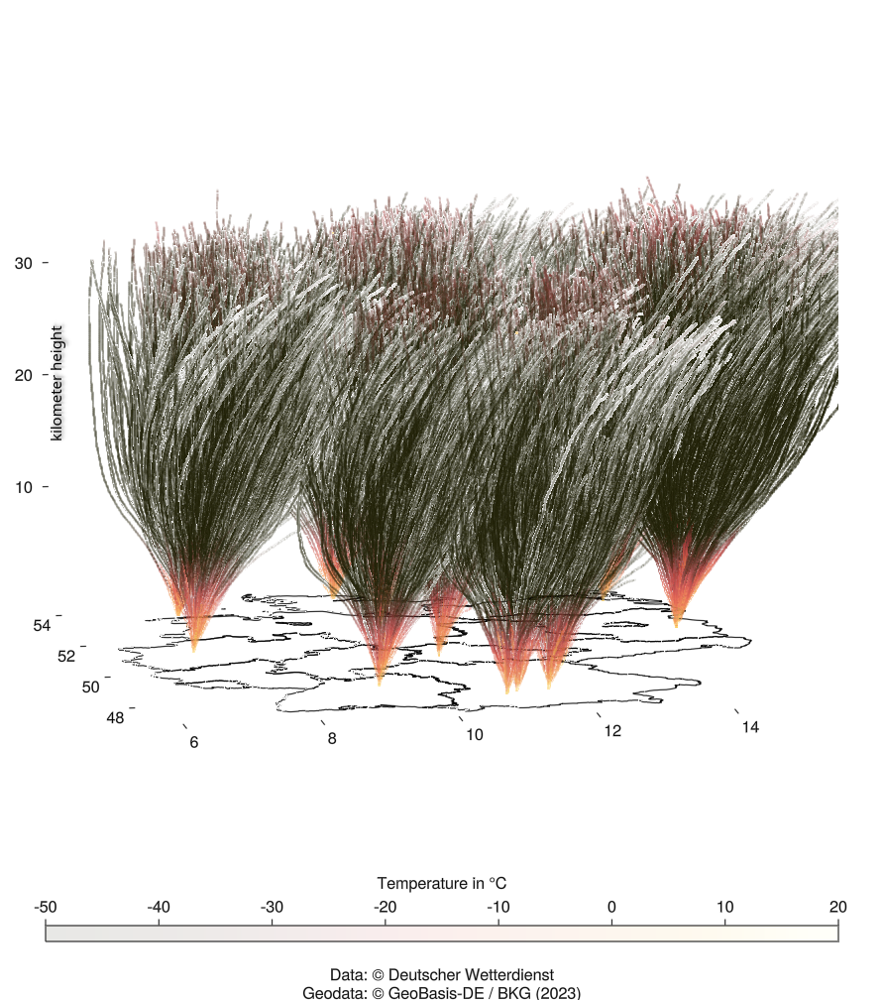

Day 18: Atmosphere
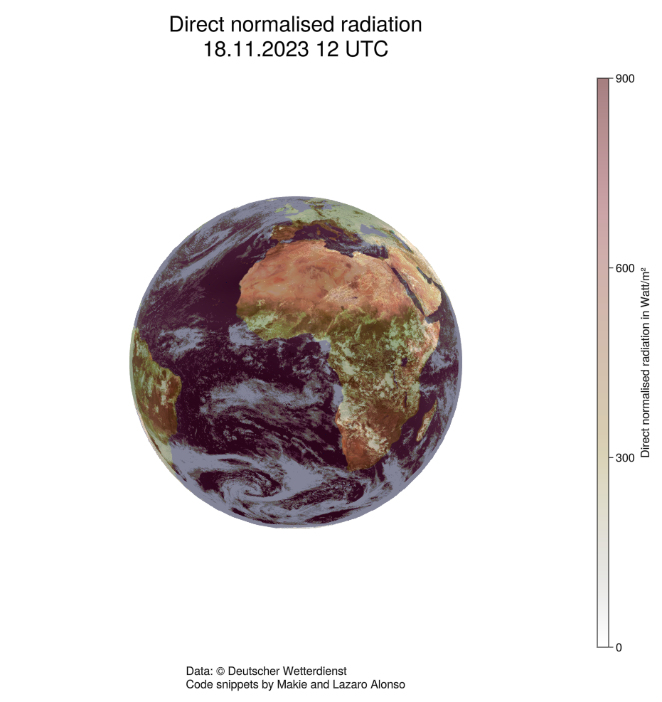

Day 21:Raster

Day 23: 3D
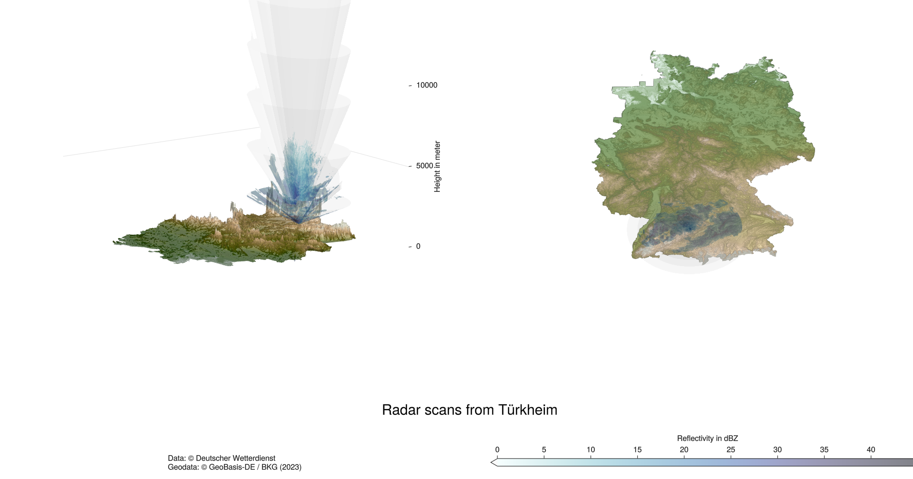

Day 24: Black & White
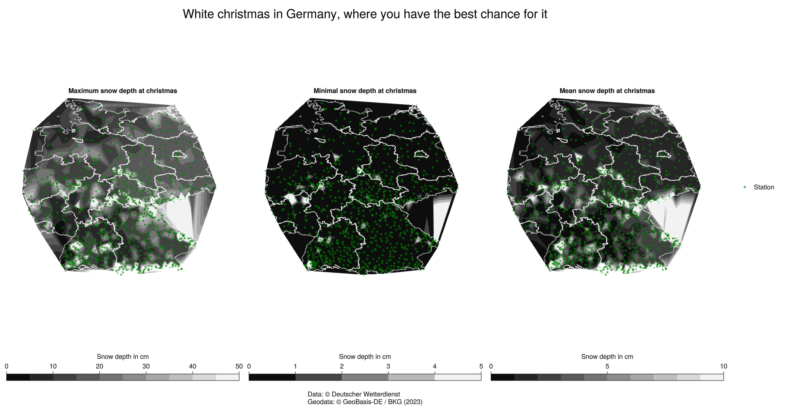

Day27: Dots
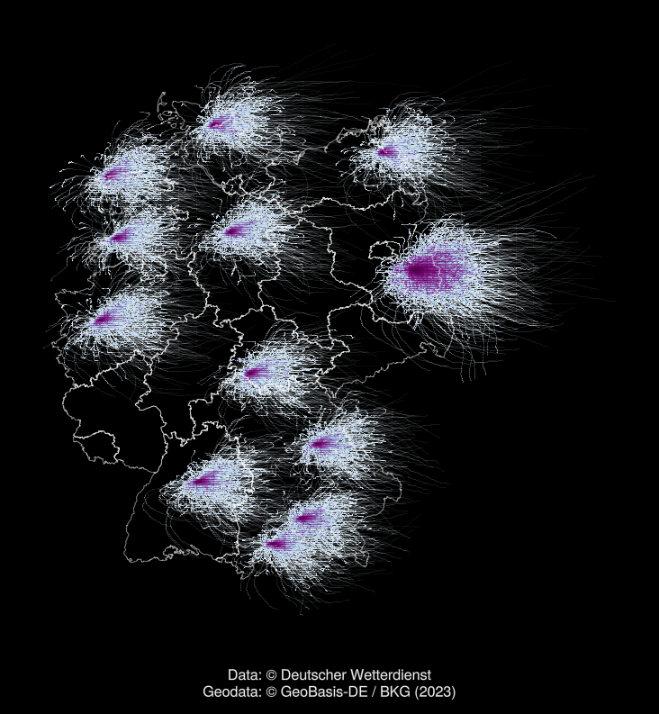

Day30: My favourite
